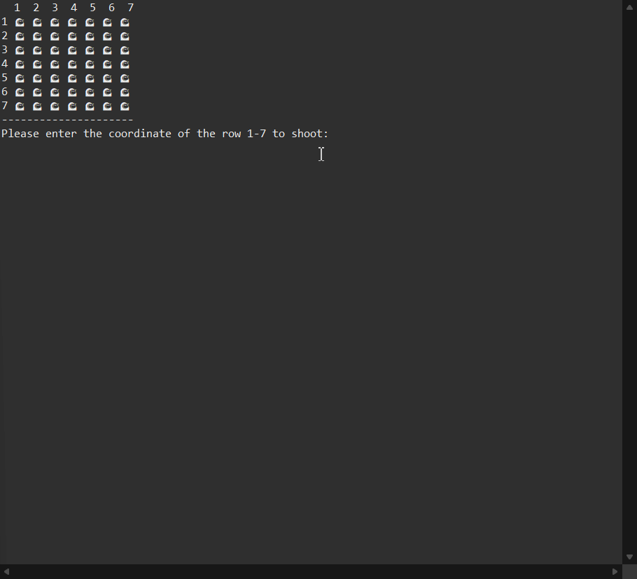

## Demo

The game is a one-player against the computer and consists of a board (7x7 grid) representing the sea, and four ships (two small and two large). Initially, the computer randomly places the ships in the sea: the small ships occupy one position on the board and the large ships occupy two consecutive positions (horizontally or vertically). The player does not know in which positions the ships have been placed. In each round, the player aims at a position on the board (row and column) and takes a shot. The goal of the game is for the player to hit all the positions of the ships on the board and thus sink all of the opponent's ships.

After the computer secretly places the ships, the player starts the shots. 

In each round, the computer: 

● receives a target (row and column) from the user. 

● informs the user whether the shot hit a ship or not. 

● gives a hint to the player: how many ships are in the row of that target and how many in its column? 

● prints the current state of the game The rounds stop when the user sinks all the ships (that is, when they hit all the positions on the board occupied by a ship).

The application was implemented in Java with version (JDK 23.0.1 - Java Standard Edition Development Kit) while (IDE) Eclipse was used as the development environment.
